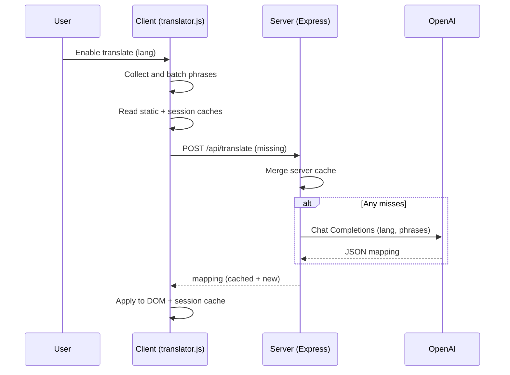

# Language Translation POC

A Vite + React frontend with a client-side DOM translator and a small Express backend that proxies to OpenAI for on-demand translations with caching.

## Highlights
- Client-only toggle to enable/disable translation at runtime (no reload).
- Batches DOM text into requests and updates in place, preserving whitespace.
- Multi-layer caching: static file, per-session cache, and server file cache.
- Server-side secret management: no API keys in the browser.
- Built-in simple language control UI (floating button + selector).

## Quick Start
- Prerequisites: Node.js 18+.
- Configure env: copy `.env.example` to `.env` and set values.
  - `OPENAI_API_KEY` is required for live translations.
  - `OPENAI_MODEL` defaults to `gpt-4o-mini`.
- Install deps and run both servers:
  - `npm install`
  - `npm start`
- Open the app:
  - Frontend: http://localhost:5173 (Vite dev)
  - API: http://localhost:3001 (Express)

## Architecture Sketch

```
┌──────────────────────────────────────────────────────────────────────┐
│                              Browser (App)                           │
│  React UI (Vite)                                                     │
│  ┌────────────────────────────────────────────────────────────────┐  │
│  │ public/translator.js                                           │  │
│  │  - Scans DOM text + pseudo-attrs                               │  │
│  │  - Batches to /api/translate                                   │  │
│  │  - Applies translations inline                                  │  │
│  │  - Caches per sessionStorage                                    │  │
│  └────────────────────────────────────────────────────────────────┘  │
│              ▲                         ▲                              │
│              │ sessionStorage          │ seed                          │
│              │                         │                               │
│     ┌────────┴────────┐        ┌───────┴───────────────────────────┐   │
│     │ Per-tab cache   │        │ public/translations.json         │   │
│     └─────────────────┘        └──────────────────────────────────┘   │
└──────────────────────────────────────────────────────────────────────┘
                      │  /api (proxy via Vite)                           
                      ▼                                                  
┌──────────────────────────────────────────────────────────────────────┐
│                           Express Backend                             │
│ server/index.js                                                       │
│  - Reads .env: OPENAI_API_KEY, OPENAI_MODEL                           │
│  - File cache: data/translations.json                                 │
│  - Endpoint: POST /api/translate                                      │
│      • Merge cached hits                                              │
│      • For misses, call OpenAI and update cache                       │
└──────────────────────────────────────────────────────────────────────┘
                      │                                                  
                      ▼                                                  
┌──────────────────────────────────────────────────────────────────────┐
│                              OpenAI API                               │
└──────────────────────────────────────────────────────────────────────┘
```

## Request Flow (Plot)

```
User enables Translate
  → translator.js collects text nodes and pseudo-attributes
    → lookup in static translations.json (seed)
    → lookup in sessionStorage (per tab)
    → missing phrases POST /api/translate [{phrases, lang}]
        → server merges from data/translations.json (file cache)
        → for remaining misses, calls OpenAI Chat Completions
        → merges results into cache and returns mapping
    → client applies mapping to DOM and saves to sessionStorage
```

Mermaid sequence (optional render):



## Key Files
- Frontend translator: `public/translator.js`
- Static seed translations: `public/translations.json`
- Backend service: `server/index.js`
- Vite proxy for API: `vite.config.mjs`
- Env template: `.env.example`

## Configuration
Create `.env` with:

```
OPENAI_API_KEY=your-key-here
OPENAI_MODEL=gpt-4o-mini
PORT=3001
```

Optional environment variables:
- `CACHE_DIR`: defaults to `./data` for server cache.

## How Translation Works
- DOM scan: finds text nodes (skips `<script>`, `<style>`, code blocks) and selected pseudo-attributes.
- Batching: sends up to `BATCH_SIZE` items per request; retries with backoff on rate limits.
- Caching strategy:
  - Static seed: `public/translations.json` (developer-authored, read-only at runtime).
  - Session cache: `sessionStorage` per language to avoid duplicate requests per tab.
  - Server cache: `data/translations.json` persisted across runs; merges static seed on boot.
- Accessibility: overlay shown during long-running translations; HTML `lang`/`dir` attributes updated.

## Security Notes
- Secrets live only in `.env` on the server. Never embed keys in client code.
- GitHub push protection may block pushes if a key appears in history. If that happens:
  - Rotate the key.
  - Rewrite the commit containing the secret (interactive rebase or filter-repo) and force-push with lease.
- Local secret scanning:
  - `detect-secrets` pre-commit is configured. Generate a baseline: `detect-secrets scan > .secrets.baseline` then `pre-commit install`.

## Scripts
- `npm start`: runs Express API and Vite dev server.
- `npm run server`: runs Express API only (http://localhost:3001).
- `npm run client`: runs Vite dev only (http://localhost:5173).

## Known Limitations
- Large or highly dynamic pages may require multiple passes; rate limits are handled with simple backoff.
- Static seed file is not updated automatically; server cache persists new results.
