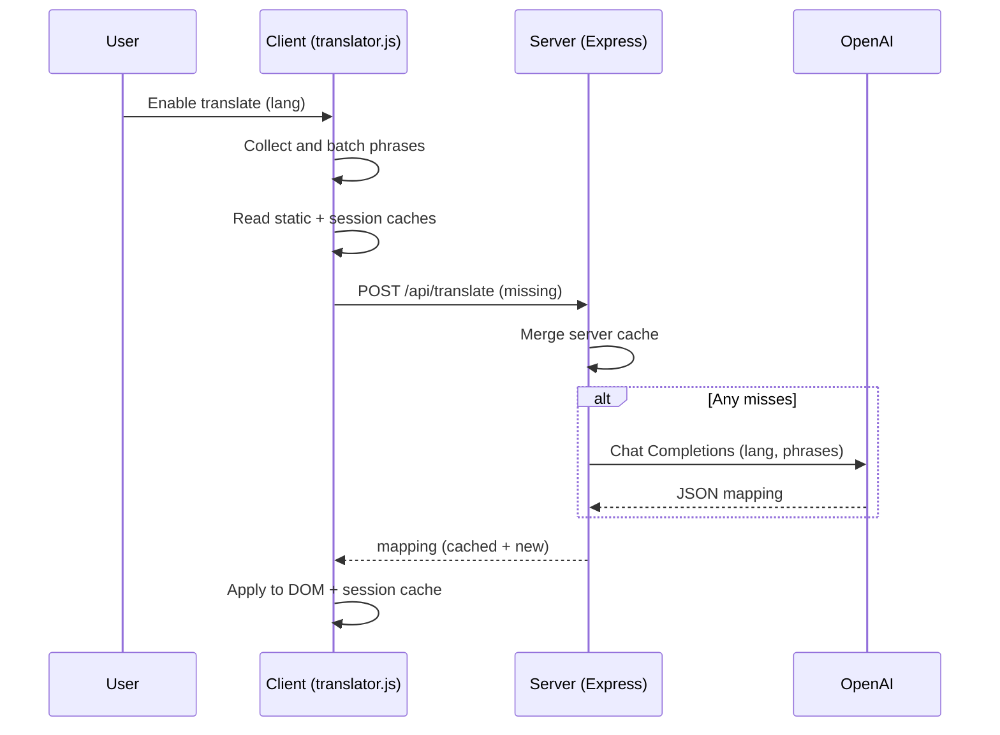

# Language Translation POC

A Vite + React frontend with a client-side DOM translator and a small Express backend that proxies to OpenAI for on-demand translations with caching.

## Highlights
- Client-only toggle to enable/disable translation at runtime (no reload).
- Batches DOM text into requests and updates in place, preserving whitespace.
- Multi-layer caching: static file, per-session cache, and server file cache.
- Server-side secret management: no API keys in the browser.
- Built-in simple language control UI (floating button + selector).

## Quick Start
- Prerequisites: Node.js 18+.
- Configure env: copy `.env.example` to `.env` and set values.
  - `OPENAI_API_KEY` is required for live translations.
  - `OPENAI_MODEL` defaults to `gpt-4o-mini`.
- Install deps and run both servers:
  - `npm install`
  - `npm start`
- Open the app:
  - Frontend: http://localhost:5173 (Vite dev)
  - API: http://localhost:3001 (Express)

## Architecture Sketch

```
┌──────────────────────────────────────────────────────────────────────┐
│                              Browser (App)                           │
│  React UI (Vite)                                                     │
│  ┌────────────────────────────────────────────────────────────────┐  │
│  │ public/translator.js                                           │  │
│  │  - Scans DOM text + pseudo-attrs                               │  │
│  │  - Batches to /api/translate                                   │  │
│  │  - Applies translations inline                                  │  │
│  │  - Caches per sessionStorage                                    │  │
│  └────────────────────────────────────────────────────────────────┘  │
│              ▲                         ▲                              │
│              │ sessionStorage          │ seed                          │
│              │                         │                               │
│     ┌────────┴────────┐        ┌───────┴───────────────────────────┐   │
│     │ Per-tab cache   │        │ public/translations.json         │   │
│     └─────────────────┘        └──────────────────────────────────┘   │
└──────────────────────────────────────────────────────────────────────┘
                      │  /api (proxy via Vite)                           
                      ▼                                                  
┌──────────────────────────────────────────────────────────────────────┐
│                           Express Backend                             │
│ server/index.js                                                       │
│  - Reads .env: OPENAI_API_KEY, OPENAI_MODEL                           │
│  - File cache: data/translations.json                                 │
│  - Endpoint: POST /api/translate                                      │
│      • Merge cached hits                                              │
│      • For misses, call OpenAI and update cache                       │
└──────────────────────────────────────────────────────────────────────┘
                      │                                                  
                      ▼                                                  
┌──────────────────────────────────────────────────────────────────────┐
│                              OpenAI API                               │
└──────────────────────────────────────────────────────────────────────┘
```

## Request Flow (Plot)

```
User enables Translate
  → translator.js collects text nodes and pseudo-attributes
    → lookup in static translations.json (seed)
    → lookup in sessionStorage (per tab)
    → missing phrases POST /api/translate [{phrases, lang}]
        → server merges from data/translations.json (file cache)
        → for remaining misses, calls OpenAI Chat Completions
        → merges results into cache and returns mapping
    → client applies mapping to DOM and saves to sessionStorage
```

Mermaid sequence (optional render):



## Key Files
- Frontend translator: `public/translator.js`
- Static seed translations: `public/translations.json`
- Backend service: `server/index.js`
- Vite proxy for API: `vite.config.mjs`
- Env template: `.env.example`

## Configuration
Create `.env` with:

```
OPENAI_API_KEY=your-key-here
OPENAI_MODEL=gpt-4o-mini
PORT=3001
```

Optional environment variables:
- `CACHE_DIR`: defaults to `./data` for server cache.

## How Translation Works
- DOM scan: finds text nodes (skips `<script>`, `<style>`, code blocks) and selected pseudo-attributes.
- Batching: sends up to `BATCH_SIZE` items per request; retries with backoff on rate limits.
- Caching strategy:
  - Static seed: `public/translations.json` (developer-authored, read-only at runtime).
  - Session cache: `sessionStorage` per language to avoid duplicate requests per tab.
  - Server cache: `data/translations.json` persisted across runs; merges static seed on boot.
- Accessibility: overlay shown during long-running translations; HTML `lang`/`dir` attributes updated.

## Caching Details

- Layers: three cooperating caches keep requests minimal and override semantics clear.
  - Static seed (client): `public/translations.json` read at runtime by the browser; developer‑curated, read‑only.
  - Per‑tab cache (client): `sessionStorage` under keys `translations_<lang>`; stores server responses for this tab/session.
  - File cache (server): `data/translations.json`; persisted across runs; seeded from the static file on boot.

- Data shape: all caches use exact, trimmed source strings as keys and translated strings as values.
  - `public/translations.json` example:
    `{ "fr": { "Home": "Accueil", "Contact": "Contact" }, "es": { ... } }`
  - Client sessionStorage per language: `{ "<source>": "<translation>", ... }` stored at `translations_<lang>`.
  - Server file cache: `{ "<lang>": { "<source>": "<translation>", ... }, ... }` written as pretty JSON.

- Precedence and lookup order:
  - Client resolution: static seed → per‑tab session cache → request missing phrases from server.
  - Server resolution: in‑memory cache → provider (OpenAI) only for misses.
  - Curated wins: values in `public/translations.json` are always preferred on the client. On server boot, the static file is merged into the server cache (static values overwrite server values), then persisted on the next save.

- Write path and lifecycle:
  - Client writes: only after a server response, the client merges returned pairs into `sessionStorage` for that language and keeps them for the lifetime of the tab. Fallback identity mappings (when the server didn’t return a value) are not persisted.
  - Server writes: merges provider results into the in‑memory `CACHE[lang]` and schedules a debounced save (~200ms) to `data/translations.json`.
  - Boot seeding: server loads `data/translations.json` if present, then overlays values from `public/translations.json` (if present).

- Keys and normalization:
  - Keys are the trimmed text values extracted from the DOM; leading/trailing whitespace is preserved separately for rendering but not part of the cache key.
  - Numeric‑only values (e.g., "123", "1,234.00") are skipped and never sent/cached.
  - Keys are case‑ and punctuation‑sensitive; distinct variants are distinct entries.

- In‑flight de‑duplication:
  - Client batches phrases (`BATCH_SIZE`) and deduplicates concurrent requests using an internal `INFLIGHT` map keyed by `lang+payload` to avoid duplicate API calls.

- Size characteristics and practical limits:
  - Static seed (`public/translations.json`): shipped to the browser once. Keep small to protect page weight; aim for ≤200–500 KB for typical apps. Consider including only commonly seen phrases or splitting by language if it grows.
  - Per‑tab session cache (`sessionStorage`): browsers typically allow ~5 MB per origin. A rough rule of thumb is ~150–220 bytes per pair (key + value + JSON overhead, pretty compact once serialized). Examples (very approximate):
    - 1,000 pairs ≈ 150–220 KB
    - 10,000 pairs ≈ 1.5–2.2 MB
    - 20,000 pairs ≈ 3–4.5 MB
    These fit comfortably under typical limits; the cache is cleared when the tab closes.
  - Server file cache (`data/translations.json`): grows with unique phrases across all languages. Pretty‑printed JSON (~2‑space indent) adds overhead; plan for ~180–260 bytes per pair. Examples:
    - 10,000 pairs ≈ 2–3 MB per language
    - 100,000 pairs ≈ 20–30 MB per language
    If this grows too large for your use case, consider sharding per language (e.g., `data/cache/<lang>.json`), compressing at rest, or moving to a key/value store.

- Observability and maintenance:
  - Inspect counts: `GET /api/cache/stats` returns per‑language pair counts and file paths.
  - Health: `GET /api/health` exposes whether OpenAI is configured and current server backoff window.
  - Manual edits: you can safely edit `data/translations.json` while the server is stopped. To override a translation permanently, add it to `public/translations.json`; it will supersede server values on next boot and be persisted thereafter.

- Eviction and TTL:
  - No automatic eviction or TTL is implemented. In practice, the per‑tab cache is naturally bounded by browser limits and cleared on tab close; the server cache grows monotonically. If you need bounds, add a background compaction step or migrate to a bounded store (e.g., LRU by access time, capped per language).

## Security Notes
- Secrets live only in `.env` on the server. Never embed keys in client code.
- GitHub push protection may block pushes if a key appears in history. If that happens:
  - Rotate the key.
  - Rewrite the commit containing the secret (interactive rebase or filter-repo) and force-push with lease.
- Local secret scanning:
  - `detect-secrets` pre-commit is configured. Generate a baseline: `detect-secrets scan > .secrets.baseline` then `pre-commit install`.

## Scripts
- `npm start`: runs Express API and Vite dev server.
- `npm run server`: runs Express API only (http://localhost:3001).
- `npm run client`: runs Vite dev only (http://localhost:5173).

## Known Limitations
- Large or highly dynamic pages may require multiple passes; rate limits are handled with simple backoff.
- Static seed file is not updated automatically; server cache persists new results.
